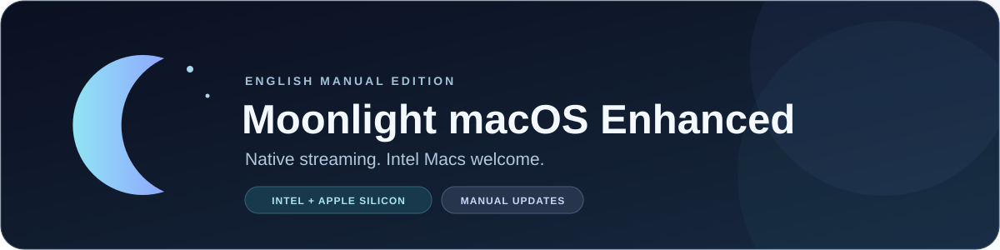

<div align="center">



# 🌙 Moonlight macOS Enhanced

### Your games. Your Mac. Native streaming.

**English UI · Intel + Apple Silicon · Manual updates only**

[](https://github.com/th3d3ck3r/moonlight-macos-enhanced-ENG/actions/workflows/rebuild-validation.yml)
[](https://github.com/moonlight-stream/moonlight-qt/releases/tag/v6.2.0)


[](LICENSE.txt)

**A native AppKit / SwiftUI Moonlight client for Sunshine and Foundation Sunshine.**

Built with the protocol core used by **Moonlight PC v6.2.0 — the latest official Moonlight PC release as of October 6, 2026** — plus selected improvements reimplemented for native macOS. Enhanced microphone, clipboard and audio extensions are retained.

**🫧 Liquid Glass is coming.** A native Tahoe UI refresh is planned; it is not included in this release.

[📦 Downloads](#-downloads) · [✨ Features](#-features) · [🚀 Getting started](#-getting-started) · [🧪 Validation](#-validation)

</div>

---

## 📦 Downloads

> **One maintained edition. All English. You choose when to update.**
> Download a ZIP below, unzip it, and install `Moonlight.app`.

**Release:** the native 6.2 rebuild for Intel macOS Tahoe. Intel-only and Universal packages passed full build validation; live streaming still needs physical Mac testing.

| Your Mac | Download |
|---|---|
| 🖥️ **Intel Mac — recommended for Intel** | [⬇️ Download Intel ZIP](https://github.com/th3d3ck3r/moonlight-macos-enhanced-ENG/releases/download/native-6.2-manual-21/Moonlight-manual-x86_64.zip) |
| 🍎 **Universal — Intel + Apple Silicon** | [⬇️ Download Universal ZIP](https://github.com/th3d3ck3r/moonlight-macos-enhanced-ENG/releases/download/native-6.2-manual-21/Moonlight-manual-universal.zip) |

[Release notes](https://github.com/th3d3ck3r/moonlight-macos-enhanced-ENG/releases/tag/native-6.2-manual-21) · [Builds in order](docs/RELEASE_INDEX.md) · [All releases](https://github.com/th3d3ck3r/moonlight-macos-enhanced-ENG/releases) · [SHA-256 checksums](https://github.com/th3d3ck3r/moonlight-macos-enhanced-ENG/releases/download/native-6.2-manual-21/SHA256SUMS.txt)

> These packages are not Developer ID signed or notarized. macOS may require **System Settings → Privacy & Security → Open Anyway**. Privileged AWDL helper authorization has not been validated with a Developer ID signature.

**Your update policy:** no automatic updater, no upstream update feed. About and onboarding link to this fork. Older releases stay available in the [release archive](docs/RELEASE_INDEX.md); future builds use the English Manual edition.

---

## ✨ Features

| Area | What this rebuild offers |
|---|---|
| 🖥️ **Native macOS** | AppKit / SwiftUI interface, English-only localization, Intel and Universal packages |
| 🎬 **Video** | H.264, hardware-gated HEVC/AV1 negotiation, optional HDR and existing native color/timing controls |
| ⚡ **Decoding** | Hardware VideoToolbox preference enabled by default; persistent software fallback for Native and Metal renderers |
| 🎨 **Rendering** | Auto, Native, Metal and Compatibility choices; MetalFX checked against the actual GPU |
| 🎮 **Input** | Existing mouse/controller paths, extended keyboard keys, keypad Enter distinction and held-key cleanup |
| 🔊 **Audio** | Stereo and existing 5.1 / 7.1 / 7.1.4 negotiation, compatibility modes and CoreAudio settings |
| 🎙️ **Microphone** | Enhanced microphone uplink retained for compatible hosts |
| 📋 **Clipboard** | Bidirectional text and single-image sync retained for compatible Foundation Sunshine hosts |
| 🌐 **Network** | Bonjour discovery, manual IP, existing port/IPv6 support and Tahoe Local Network declarations |
| 🛡️ **Protocol** | Official 6.2 RTSP hardening, socket handling, FEC/loss-recovery fixes, crypto updates and host XML validation |

Codec, HDR, surround, microphone and clipboard availability depends on your GPU, display, audio device and host. Retained features still need end-to-end testing with a real host.

<details>
<summary><strong>🎨 Which renderer should I use?</strong></summary>

| Renderer | Purpose |
|---|---|
| **Native** | Recommended default; VideoToolbox and native sample-buffer presentation |
| **Metal** | Native Metal presentation with advanced color, HDR and timing controls |
| **Compatibility** | Existing system presentation path for troubleshooting |
| **Auto** | Native selection with compatibility fallback |

For decoder troubleshooting, enable **Use Software Decoding**, then reconnect. The setting applies to all hosts and can increase CPU usage. Compatibility mode uses the system's decoder selection.

The native architecture is preserved. Qt, MoltenVK and libplacebo are not added to this rebuild.

</details>

## 🚀 Getting started

1. Download the Intel or Universal ZIP, unzip it, and move **Moonlight.app** to **Applications**.
2. Start Sunshine or a compatible host on your gaming PC, then open Moonlight.
3. Allow **Local Network** access. Select a discovered host, or add its IP address manually.
4. Pair using the PIN shown by Moonlight, then select a game or Desktop from the app list.
5. Start with **H.264 SDR** and the **Native** renderer. Test HEVC when your Mac supports it; enable HDR only with a compatible host/display.

The deployment target remains macOS 12. Tahoe is the build-validation target for this rebuild; older macOS versions have not been runtime-tested here.

## ⌨️ Everyday controls

| Default shortcut | Action |
|---|---|
| **Control + Option** | Release mouse capture |
| **Control + Option + S** | Toggle performance overlay |
| **Control + Option + M** | Switch mouse mode |
| **Control + Option + W** | Disconnect stream |
| **Control + Option + R** | Reconnect stream |
| **Control + Option + C** | Open Control Center in fullscreen/borderless mode |

Shortcuts can be changed in **Settings → Input → Keyboard**. Free Mouse is useful for desktop/multiple-display use; Locked Mouse suits games that need relative mouse movement.

## 🫧 Coming next: Liquid Glass

A native Tahoe UI refresh is planned: polished Settings, clearer sidebars/toolbars/popovers, cleaner cards, and better spacing, typography and icons. Glass will be used selectively where it helps the interface.

**Status: planned.** This release focuses on protocol integration, Intel compatibility, English UI and build validation. Liquid Glass is not implemented in this release.

## 🧪 Validation

The [latest code-review report](docs/CODE_REVIEW_2026_10_06.md) records the follow-up fixes and test limits. The detailed [integration report](docs/MOONLIGHT_6_2_REBUILD.md) records exact upstream commits, conflict resolutions, selected native ports, exclusions, build results, warnings and the [Intel Tahoe test checklist](docs/MOONLIGHT_6_2_REBUILD.md#intel-tahoe-test-checklist).

**Intel-only and Universal full builds passed** in [the release validation run](https://github.com/th3d3ck3r/moonlight-macos-enhanced-ENG/actions/runs/37563407960). The Intel package was cross-compiled with an explicit x86_64 target on the Tahoe Apple Silicon runner; physical Intel streaming remains untested.

Automated checks cover full Intel/Universal application builds, executable/helper architecture checks, recursive submodule checkout, English/LAN bundle declarations, common-c FEC/crypto/input boundaries, production host XML and logger redaction tests, RTSP malformed-input tests, and production clipboard receive tests.

**Physical Mac tests remain:** permission prompts, discovery/pairing, real app lists, stream startup/shutdown/reconnect, hardware decoding, pacing/color/HDR, input/controller, audio, microphone, clipboard and settings persistence. Passing a build does not certify those behaviors.

## 🛠️ Build from source

<details>
<summary><strong>Open the Xcode build instructions</strong></summary>

```bash
git clone --recurse-submodules --branch master \
  https://github.com/th3d3ck3r/moonlight-macos-enhanced-ENG.git
cd moonlight-macos-enhanced-ENG

curl --fail --location --retry 3 -o xcframeworks.zip \
  https://github.com/coofdy/moonlight-mobile-deps/releases/download/latest/moonlight-apple-xcframeworks.zip
unzip -q -o xcframeworks.zip -d xcframeworks

xcodebuild -project Moonlight.xcodeproj -scheme 'Moonlight for macOS' \
  -configuration Release -derivedDataPath build \
  -destination 'generic/platform=macOS' ARCHS=x86_64 ONLY_ACTIVE_ARCH=NO \
  CODE_SIGNING_ALLOWED=NO CODE_SIGNING_REQUIRED=NO CODE_SIGN_IDENTITY='' build
```

The English, manual-update-only edition now builds directly from `master` ([branch policy](docs/BRANCH_CONSOLIDATION.md)). Download future updates from this fork’s GitHub releases. There is no automatic updater.

For Universal, use `ARCHS='x86_64 arm64'`. Xcode 26.6 was used for the Tahoe builds. The common-c submodule points to [the maintained Enhanced fork](https://github.com/th3d3ck3r/moonlight-common-c/tree/rebuild-moonlight-6.2-enhanced), with its custom extensions preserved.

</details>

## 🐛 Troubleshooting & feedback

- **No discovered host:** check Local Network access, host availability/firewall, and try manual IP.
- **Decode/render problem:** compare Native and Compatibility; try software decoding and reconnect.
- **HDR/color problem:** return to SDR first, then record the host, codec, renderer and display settings.
- **Microphone/clipboard problem:** verify host extension support and permissions; test after reconnecting.

[Report an issue](https://github.com/th3d3ck3r/moonlight-macos-enhanced-ENG/issues) with Mac model, macOS version, host/version, codec/renderer, reproduction steps and exported debug logs.

## 🙏 Credits & license

Built on [Moonlight macOS](https://github.com/MichaelMKenny/moonlight-macos), [Moonlight iOS](https://github.com/moonlight-stream/moonlight-ios), [Moonlight macOS Enhanced](https://github.com/skyhua0224/moonlight-macos-enhanced) and [moonlight-common-c](https://github.com/moonlight-stream/moonlight-common-c). [Moonlight PC](https://github.com/moonlight-stream/moonlight-qt) supplies the 6.2 protocol/behavior reference; [Sunshine](https://github.com/LizardByte/Sunshine) and [Foundation Sunshine](https://github.com/qiin2333/foundation-sunshine) supply the host ecosystem.

Upstream copyrights, notices and licenses remain intact. See [acknowledgements](ACKNOWLEDGEMENTS.md) and [GPLv3](LICENSE.txt).
